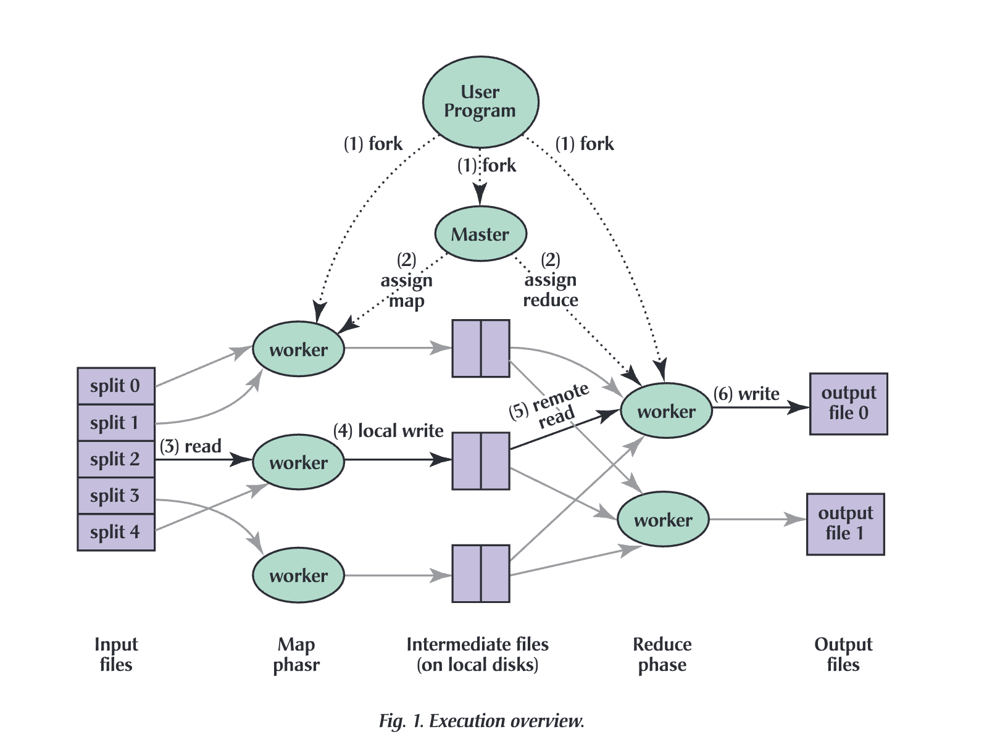

# CS 5450: Networked and Distributed Systems Assignment 3: MapReduce

## Program Running

Running Environment (Either One)

* Ubuntu 22.04.3 LTS
* macOS Sonoma 14.3 with Chip Apple M1 Pro

Our Makefile uses C++17. Please ensure that your machine's compiler is up-to-date. Otherwise, there may be issues with the libraries.

Comands:

```bash
make clean    #optional
make
./mapreduce --input <inputdir> --output <outputdir> --nworkers <nWorkers> --nreduce <nReduce>
```

Note: We hard coded output directory as `output` or `outputdir` in the `make clean`.

## Implementation Details

### Introduction to MapReduce Framework

MapReduce is a distributed computing system designed by Google, and the corresponding paper *[MapReduce: Simplified Data Processing on Large Clusters](https://research.google/pubs/mapreduce-simplified-data-processing-on-large-clusters/)* is published in 2004. As an distributed computing framework, MapReduce is designed for processing large volume of data in parallel across a distributed cluster of processer. MapReduce abstracts the low-level distributed programmming into two primary processing steps processing phases: the map and the reduce steps. 

### Overview

Our MapReduce Implementation orchestrates multiple worker nodes through a master node to process text files for a word count task. Each worker node is designed to efficiently perform either map or reduce operation using multithreading, using the oversight of the master's scheduling system. 

### System Architecture

The following directory structure illustrates the main components of our MapReduce implementation:

```bash
lexiyin@Lexis-MacBook-Pro cs5450-a3 % tree
.
├── Makefile 				# Compilation instructions
├── config.h 				# Configuration header, defines structure for settings
├── logger.h 				# Header file for defining logger
├── mapreduce.cpp 	# Entry point for the MapReduce master node
├── mapreduce.log		# Logs are stored here
├── master.cpp  		# Implementation of detailed logic of master node function
├── master.h				
├── worker.cpp			# Worker node implementation, performs map and reduce tasks
├── worker.h
```

#### System Component

* Master Node: The master node initialized and distributed the map and reduce tasks among worker nodes, and and handle the final merging of results. This node's functionalities are primarily defined within `master.cpp` and `master.h`.
* Worker Nodes: Each worker node is responsible for executing the map and reduce tasks assigned by the master. Their behavior are implemented in `worker.cpp` and `worker.h`.

### Detailed Design

Our implementation design was based on execution overview of the paper *[MapReduce: Simplified Data Processing on Large Clusters](https://research.google/pubs/mapreduce-simplified-data-processing-on-large-clusters/)*. The image below is referred from the paper for illustration and convinient reference. 



#### Master Node

The implementation of master nodes consists of several key functions:

* **Configuration Parsing**: Parses command line arguments to set up initial configuration (shown in `mapreduce.cpp`). 

* **Wordload Split and Task Synchronization**

  * The master node splits the input files into smaller chunks (roughly 1024 bytes per chunk) and assigns them to workers, adjusting chunk boundaries to ensure word integrity. 
  * We adopted static strategy in terms of task assignment. Load balancing is initially computed rather than dynamically assigned to ideal worker, simplifying the system's design and overhead. 
  * For this equally distribution method, we took careful consideration in terms of not accidentally split a word into half by providing a 64 bytes buffer to allow each chunk to identify a safe split position.

  * The map and reduce tasks are distributed once at the start, with each worker node receiving a clear set of tasks. We maintained two vectors `mapperAssignments` and `reduceRasksList` to manage these tasks efficiently. Both of them are a vetor of vectors, where the index corresponds to the index of a worker node. The sub-vector of `mapperAssignment` contains a list of file metadata  for each worker to process during the map phrase, while the inner-vector of `reduceTasksList` contains integers that represent the indices of reduce tasks. 

  ```cpp
  std::vector<std::vector<FileMetaData>> mapperAssignments;
  std::vector<std::vector<int>> reduceTasksList; 
  ```

  * We utilize a combination of multi-threading and shared memory for managing and synchronizing tasks. This choice simplifies the implementation and is suitable for a lab setting where network latency is negligible.

#### Worker Nodes

Each worker node is responsible for processing both Map and Reduce task: 

* Map Tasks:
  * Processes each assigned file chunk, reads the data, and produces intermediate key-value pairs. For example, (word,1). 
  * Mapper also conduct word cleaning. Non-alphabetica characters and non-Latin words are filtered out, and words are converted to lowercase to ensure consistency. 
  * We are counting words that are bounded by qutation marks and followed by period as valid words. But we are ignoring words if there are non-latin letter in between the word such as what's.
  * After having key-value pairs, each key is hashed to determine which reduce task it belongs to, spreading the load evenly among reduce tasks. The intermediate files generated by mapper have the naming convention `map.part-<map task number>-<reduce task number>.txt`. This step is called partition. 
* Reduce Task
  * Reducer read the intermediate files, aggregates intermediate results from map tasks and sums up the counts for each word. For each reduce task, it generate another intermediate file with naming convention `reduce.part-<reduce task number>.txt`.

### Word Validation

We count a word as invalid when there are non-latin letter within the word. For example, what's. We ignore the world completely. But we count words that are wrapped by non-latin letters such as "yesterday" end. others' "yours?"

We used the following helper function to handle word validation.

```cpp!
// check whether a character is in latin alphabet
bool is_latin(char c);

// find the index of the first latin letter in a word
size_t find_first_latin(const std::string& word);

// find the index of the last latin letter in a word
size_t find_last_latin(const std::string& word);

// trim non-latin letter wrapping a word and convert to lower
std::string cleanWord(const std::string& word) {
    size_t start = find_first_latin(word);
    if (start == std::string::npos) return "";

    size_t end = find_last_latin(word);
    std::string cleaned = word.substr(start, end - start + 1);

    std::transform(cleaned.begin(), cleaned.end(), cleaned.begin(), ::tolower);
    return cleaned;
}

// check if the entire word contain latin letter only
bool isValidLatinWord(const std::string& word);
```

### Master-Worker Communication

For master-worker communication, our implementation uses multi-threading within a single machine environment. Worker nodes run in threads and share access to common data structures managed by the master node. This design is chosen for its simplicity and the shared-memory benefits of multithreading programming. Furthermore, it eliminates the complexity and overhead associated with network communication, making it an ideal choice for a lab environment. 

### Logging Output

A critical aspect of our implementation is the comprehensive loggin system. Our application logs every significant event, including but not limited to the start and completion of each map and reduce task, worker assginment, and file processing. The logs include timestamped entries that provide insights into the performance and aid in troubleshooting. The logs could not only be printted while the application is running, but stored in `mapreduce.log`.

Example log output looks like:
```bash
./mapreduce --input ./input --output ./output --nworkers 4 --nreduce 20
2024-04-16 00:41:35 - INFO: Starting MapReduce program
2024-04-16 00:41:35 - INFO: Configuration:
Input Directory: ./input
Output Directory: ./output
Number of Workers: 4
Number of Reduce Tasks: 20
Reduce Tasks List per Worker:
  Worker 0: 0 4 8 12 16
  Worker 1: 1 5 9 13 17
  Worker 2: 2 6 10 14 18
  Worker 3: 3 7 11 15 19

2024-04-16 00:41:35 - INFO: Master initialized
2024-04-16 00:41:35 - INFO: Read file metadata for input directory: ./input
2024-04-16 00:41:35 - INFO: Distributing work among workers
2024-04-16 00:41:35 - INFO: Work distribution complete
2024-04-16 00:41:35 - INFO: 
Worker 0 will process files:
        ./input/4.txt (20 bytes)
        ./input/3.txt (1030 bytes)
        ./input/3.txt (1026 bytes)
        ./input/7.txt (85 bytes)
Worker 1 will process files:
        ./input/1.txt (1026 bytes)
        ./input/3.txt (1029 bytes)
        ./input/5.txt (1027 bytes)
Worker 2 will process files:
        ./input/1.txt (1026 bytes)
        ./input/3.txt (1025 bytes)
        ./input/5.txt (1028 bytes)
Worker 3 will process files:
        ./input/1.txt (611 bytes)
        ./input/3.txt (1025 bytes)
        ./input/3.txt (197 bytes)
        ./input/6.txt (32 bytes)
        ./input/2.txt (13 bytes)
        ./input/5.txt (1031 bytes)

2024-04-16 00:41:35 - INFO: Workers are being started
2024-04-16 00:41:35 - INFO: Initializing worker threads
2024-04-16 00:41:35 - INFO: Worker 0 created
2024-04-16 00:41:35 - INFO: Worker 1 created
2024-04-16 00:41:35 - INFO: Worker 2 created
2024-04-16 00:41:35 - INFO: Worker 3 created
2024-04-16 00:41:35 - INFO: ====================== Map phase starting ====================
2024-04-16 00:41:35 - INFO: Worker 3 starts map tasks
2024-04-16 00:41:35 - INFO: Worker 3 completed map tasks in 0.004316 seconds
2024-04-16 00:41:35 - INFO: Worker 1 starts map tasks
2024-04-16 00:41:35 - INFO: Worker 1 completed map tasks in 0.003953 seconds
2024-04-16 00:41:35 - INFO: Worker 2 starts map tasks
2024-04-16 00:41:35 - INFO: Worker 2 completed map tasks in 0.004728 seconds
2024-04-16 00:41:35 - INFO: Worker 0 starts map tasks
2024-04-16 00:41:35 - INFO: Worker 0 completed map tasks in 0.003947 seconds
2024-04-16 00:41:35 - INFO: ====================== Map phase complete ====================
2024-04-16 00:41:35 - INFO: ====================== Reduce phase starting ====================
2024-04-16 00:41:35 - INFO: Worker 3 starts reduce task ID: 3
2024-04-16 00:41:35 - INFO: Worker 3 completed reduce task ID: 3 in 0.000295 seconds
2024-04-16 00:41:35 - INFO: Worker 3 starts reduce task ID: 7
2024-04-16 00:41:35 - INFO: Worker 3 completed reduce task ID: 7 in 0.000231 seconds
2024-04-16 00:41:35 - INFO: Worker 3 starts reduce task ID: 11
2024-04-16 00:41:35 - INFO: Worker 3 completed reduce task ID: 11 in 0.000325 seconds
2024-04-16 00:41:35 - INFO: Worker 3 starts reduce task ID: 15
2024-04-16 00:41:35 - INFO: Worker 3 completed reduce task ID: 15 in 0.000204 seconds
2024-04-16 00:41:35 - INFO: Worker 3 starts reduce task ID: 19
2024-04-16 00:41:35 - INFO: Worker 3 completed reduce task ID: 19 in 0.000229 seconds
2024-04-16 00:41:35 - INFO: Worker 3 completed reduce tasks in 0.001968 seconds
2024-04-16 00:41:35 - INFO: Worker 1 starts reduce task ID: 1
2024-04-16 00:41:35 - INFO: Worker 1 completed reduce task ID: 1 in 0.000314 seconds
2024-04-16 00:41:35 - INFO: Worker 1 starts reduce task ID: 5
2024-04-16 00:41:35 - INFO: Worker 1 completed reduce task ID: 5 in 0.000271 seconds
2024-04-16 00:41:35 - INFO: Worker 1 starts reduce task ID: 9
2024-04-16 00:41:35 - INFO: Worker 1 completed reduce task ID: 9 in 0.000237 seconds
2024-04-16 00:41:35 - INFO: Worker 1 starts reduce task ID: 13
2024-04-16 00:41:35 - INFO: Worker 1 completed reduce task ID: 13 in 0.000297 seconds
2024-04-16 00:41:35 - INFO: Worker 1 starts reduce task ID: 17
2024-04-16 00:41:35 - INFO: Worker 1 completed reduce task ID: 17 in 0.000243 seconds
2024-04-16 00:41:35 - INFO: Worker 1 completed reduce tasks in 0.002051 seconds
2024-04-16 00:41:35 - INFO: Worker 2 starts reduce task ID: 2
2024-04-16 00:41:35 - INFO: Worker 2 completed reduce task ID: 2 in 0.000238 seconds
2024-04-16 00:41:35 - INFO: Worker 2 starts reduce task ID: 6
2024-04-16 00:41:35 - INFO: Worker 2 completed reduce task ID: 6 in 0.000169 seconds
2024-04-16 00:41:35 - INFO: Worker 2 starts reduce task ID: 10
2024-04-16 00:41:35 - INFO: Worker 2 completed reduce task ID: 10 in 0.000174 seconds
2024-04-16 00:41:35 - INFO: Worker 2 starts reduce task ID: 14
2024-04-16 00:41:35 - INFO: Worker 2 completed reduce task ID: 14 in 0.000155 seconds
2024-04-16 00:41:35 - INFO: Worker 2 starts reduce task ID: 18
2024-04-16 00:41:35 - INFO: Worker 2 completed reduce task ID: 18 in 0.000163 seconds
2024-04-16 00:41:35 - INFO: Worker 2 completed reduce tasks in 0.001377 seconds
2024-04-16 00:41:35 - INFO: Worker 0 starts reduce task ID: 0
2024-04-16 00:41:35 - INFO: Worker 0 completed reduce task ID: 0 in 0.000377 seconds
2024-04-16 00:41:35 - INFO: Worker 0 starts reduce task ID: 4
2024-04-16 00:41:35 - INFO: Worker 0 completed reduce task ID: 4 in 0.000172 seconds
2024-04-16 00:41:35 - INFO: Worker 0 starts reduce task ID: 8
2024-04-16 00:41:35 - INFO: Worker 0 completed reduce task ID: 8 in 0.000139 seconds
2024-04-16 00:41:35 - INFO: Worker 0 starts reduce task ID: 12
2024-04-16 00:41:35 - INFO: Worker 0 completed reduce task ID: 12 in 0.000202 seconds
2024-04-16 00:41:35 - INFO: Worker 0 starts reduce task ID: 16
2024-04-16 00:41:35 - INFO: Worker 0 completed reduce task ID: 16 in 0.000199 seconds
2024-04-16 00:41:35 - INFO: Worker 0 completed reduce tasks in 0.001620 seconds
2024-04-16 00:41:35 - INFO: ====================== Reduce phase complete ======================
2024-04-16 00:41:35 - INFO: All Map Tasks and Reduce Tasks have finished
2024-04-16 00:41:35 - INFO: ======== Start Merging =========== 
2024-04-16 00:41:35 - INFO: ======== Merging Complete =========== 
2024-04-16 00:41:35 - INFO: MapReduce process completed in 0.030781 seconds
```